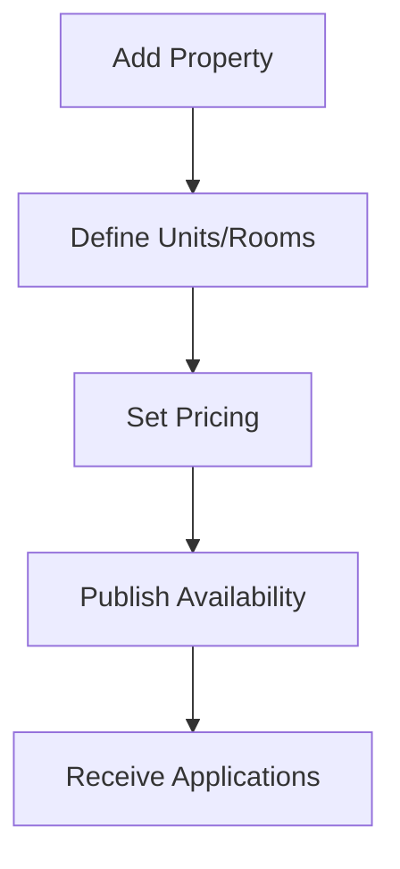

# How Kdrem Property Management System Works

## Overview
Kdrem PMS is designed to simplify property management with an intuitive interface and powerful features. Here's a simple guide to understanding how the system works:

## 1. Getting Started

### For Property Owners/Managers
1. **Login** to your admin dashboard
2. **Add Properties** by entering property details, room types, and amenities
3. **Set Up Rentals** by defining lease terms and payment schedules
4. **Manage Tenants** by adding tenant information and documents

### For Tenants
1. **Create an Account** or get registered by the property manager
2. **View Available Properties** and submit applications
3. **Sign Lease Agreements** digitally
4. **Make Payments** and submit maintenance requests online

## 2. Core Workflows

### Property Management

### Tenant Onboarding
1. **Application** - Tenants apply for available units
2. **Screening** - Manager reviews applications and documents
3. **Approval** - Approved tenants receive notification
4. **Lease Signing** - Digital lease agreement signing
5. **Move-in** - Key handover and documentation

### Rent Collection
1. **Invoice Generation** - Automatic monthly invoices
2. **Payment Options** - Online payments, bank transfers, or in-person
3. **Receipts** - Automatic receipt generation
4. **Late Fees** - Automated late fee calculations

### Maintenance Requests
1. **Submit Request** - Tenants submit requests with details/photos
2. **Review** - Manager reviews and assigns to staff/vendor
3. **Resolution** - Staff/vendor updates status upon completion
4. **Feedback** - Tenant confirms resolution

## 3. Key Features Explained

### Dashboard
- Real-time property statistics
- Upcoming rent due dates
- Maintenance request status
- Financial overview

### Property Listings
- Detailed property information
- Photo galleries
- Amenities and features
- Availability calendar

### Tenant Portal
- Personal dashboard
- Payment history
- Document storage
- Communication log

### Financial Management
- Automated rent collection
- Expense tracking
- Financial reports
- Tax documentation

## 4. Common Tasks

### Adding a New Property
1. Click "Properties" > "Add New"
2. Fill in property details
3. Upload photos and documents
4. Set rental terms and pricing
5. Publish the listing

### Processing a Maintenance Request
1. Receive notification of new request
2. Review details and assign to staff
3. Track progress in real-time
4. Mark as complete when resolved
5. Request tenant confirmation

### Generating Reports
1. Navigate to "Reports"
2. Select report type (financial, occupancy, etc.)
3. Set date range and filters
4. Generate and export report

## 5. Support and Help
- **Help Center**: Access documentation and tutorials
- **Live Chat**: Get instant support during business hours
- **Email Support**: support@kdremtech.com
- **Phone Support**: Available for premium accounts

## 6. Security
- Data encryption
- Role-based access control
- Regular backups
- Activity logging

## 7. Mobile Access
- Responsive design works on all devices
- Mobile app available for iOS and Android
- Push notifications for important updates

## Need More Help?
Visit our [Documentation](DOCUMENTATION.md) or contact our support team for personalized assistance.
